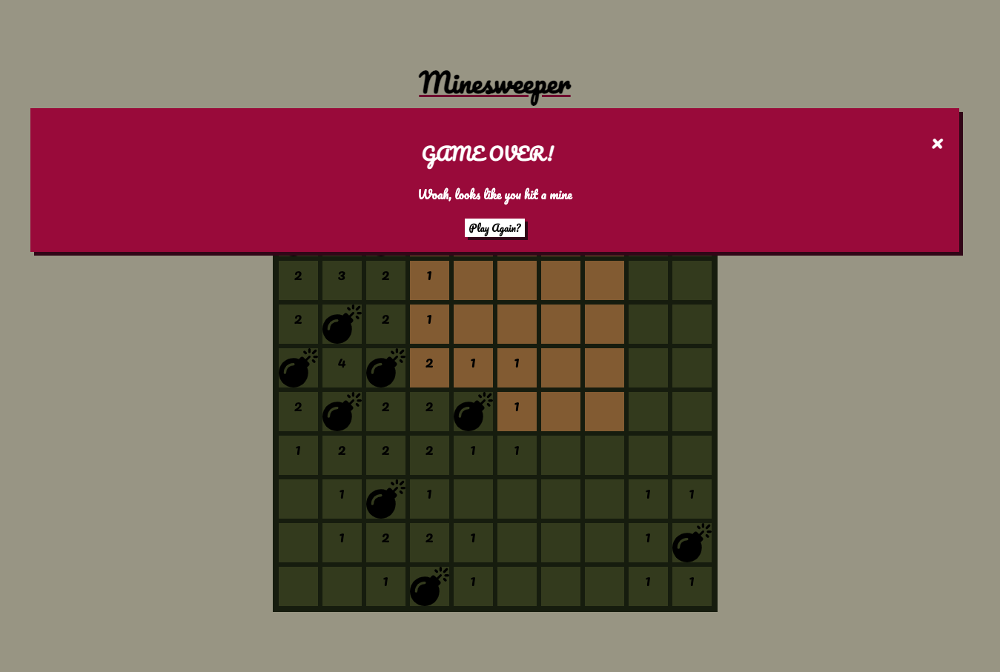

# Project 1: Minesweeper

## Overview
For the first project, we were tasked with building a grid based game to demonstrate interaction with the DOM, array based logic and relative board size rendering for scalability. From the options, I decided to go for Minesweeper as it’s a game I grew up knowing about but never understood how to play until recently and it looked like a good challenge.

### What is Minesweeper?
For those that might not have heard of it, Minesweeper is a classic Windows PC game where you are tasked with clearing a board of tiles by using indicators of nearby mines to inform your decision of whether or not to flip a tile. Here’s some steps to get you started:

### Instructions
* The game starts with 10 randomly placed mines hidden on the board with numbers indicating how many mines are surrounding a given tile (also hidden).  
* Like most grid based games, each tile has 8 surrounding tiles. On each click, you will see nearby tiles will be uncovered, revealing a number for any nearby mines.
* Right click on any tile that you think may be concealing a mine. 
* Click on a mine and the game is over.

### Project Brief
* Render a game in the browser
* Design logic for winning & visually display which player won
* Include separate HTML / CSS / JavaScript files
* Stick with KISS (Keep It Simple Stupid) and DRY (Don’t Repeat Yourself) principles
* Use JavaScript for DOM manipulation
* Deploy your game online, where the rest of the world can access it
* Use semantic markup for HTML and CSS (adhere to best practices)

### Web Technologies 
* HTML5 and CSS3
* JavaScript (ES6)
* Git & Github

### Deployed Project
You can find this deployed [here](https://abubakr-s.github.io/project-1/).

## Planning
My approach to planning this project was to find an online version of the game, analyse it as I played it through till the end and break down the order of events. I also went through the rules to make sure I didn’t miss anything out. I then took note of these and started to group key areas together, which I later used to pseudocode. When it came to the sweeping functionality, whiteboarding helped me visualise the looping / recursive behaviour that was required for each tile. 

### Start and End Conditions
* Game Starts when the player clicks the first tile (any)
* Game Over when the player clears all the tiles or clicks on a mine 

### UI Components
* Number of Flags Remaining (initialise at total)
* Timer (counting up) once the game has started and will stop once the player wins / loses
* Game state (is playing)

### Features
* An empty space
* A number (representing surrounding mines)
* A mine
* A flag
* Difficulty (start with 10 X 10 grid with 10 mines and 10 flags)

### Constructing The Grid
* The grid should be a div of divs (10 X 10)
* Store the tiles in an array, which will be appended to the grid container
* Use a loop to create the grid, to allow room for stretch goals (additional levels)
* Use a width variable to track number of tiles per row, the number of mines and the number of flags
* Store the mines in an array, which will be appended to the grid

### Planning Game Logic
* All tiles should be covered at the start
* You should not be able to add a flag at the start of the game unless a tile has been clicked
* You should be able to toggle a flag. Keep track of the number of remaining flags (width - flags)
* Once a tile has been clicked, start the timer
* Every tile surrounding a mine should have a number indicating how many mines it is touching.
* Trigger a modal upon winning or losing

#### DOM Attributes
* id - a value from 0-99
* data attributes: 
		* counter - nearby mines indicator
		* sweeped - whether a counter more than 0 has been uncovered
* class: 
	* checked - an empty, uncovered tile
	* mine - a bomb on the grid
	 
```js
// an empty, uncovered tile
<div id="0" data-counter="0" data-sweeped="false" style="width: 10%; height: 10%;" class="checked"></div>

// an uncovered mine indicator with a value of 1
<div id="3" data-counter="1" data-sweeped="true" style="width: 10%; height: 10%;" class="one">1</div>

// an uncovered mine
<div id="4" data-counter="0" class="mine" style="width: 10%; height: 10%;"></div>
```

#### Check Surrounding Tiles, for a Given Tile (Index)
The aim of this functionality was to sweep all surrounding tiles every time a tile was clicked.

*Whiteboarding Sweeping Logic*


Locations:
* North (U)
* North East (UR)
* East (R)
* South East (DR)
* South (D)
* South West (DL)
* West (L)
* North West (UL)

Analysis of an example game helped me identify some boundaries:

*Google's Minesweeper Boundaries*

  

I realised that the number of surrounding tiles would differ across the grid, for example if a tile was in a corner or along an edge, so I factored that in as well. I wanted to use relative units to provide the flexibility for additional levels in the future. 

```js
u = index - width
ur = index - width + 1
r = index + 1
dr = index + width + 1
d = index + width
dl = index + width - 1
l = index - 1
ul = index - width - 1

firstColumn = (index % width === 0)
lastColumn = (index % width === width - 1)
```

##### Boundaries for Clearing Empty Tiles
* Grid edges
* Mine indicators

##### Sweeping Thought Process
• Uncover every empty tile in the area, including the numbered tiles, using the numbered tiles and grid edges as a boundary
• If the tile clicked is empty, reveal nearby tiles (8)
• If any of those nearby tiles are empty, reveal those (recursively loop through of those tiles and so on…)
• Keep track of checked tiles and avoid checking them again


## Developing Game Logic
Below I’ve highlighted the main components of the game.

1. **Generate a board (grid)**

As mentioned above, with future proofing in mind for various difficulty levels, I used the width to relatively calculate the grid size. 

*Generate board*


2. **Game start condition**

For a seamless start to a widely recognised game, I wanted the first click on any tile to start the game. I set a condition for number of clicks is 1 to uncover the first tile, which would also have to be a safe tile. This was also the trigger to start the timer.  ::However, I later had to remove this feature to get my recursion to work and instead listened for the first left click, accepting the tradeoff of possibly hitting a mine immediately.::

3. **Populate board with randomly placed mines**

I started by generating random grid position numbers which I later used as indexes for the placed mines. This required the following conditions:

* Ensure that a mine does not already exist at the given random index to avoid duplication
* Ensure that a mine is not placed on a tile surrounding the first flipped tile to keep the area clear
 
*Generate mines*
```js
while (mines.length < width) {
    const randomIndex = Math.floor(Math.random() * (width ** 2))
    if (!mines.includes(randomIndex)) {
      mines.push(randomIndex)
    }
}
```

*Add mines to board*
```js
mines.forEach(mine => {
	tiles[mine].classList.add('mine')
  tiles[mine].attributes.removeNamedItem('data-sweeped')
	...
})
```

4. **Aggregate total number of surrounding mines and populate surrounding tiles**

To display the aggregated surrounding mines counter, I used the `data-counter` attributes and initialised it to 0 on a new board. To check all valid tiles surrounding a mine, I gave each tile an index and calculated the position of each of the possible 8 locations, relative to the currently clicked tile. I then incremented the `data-counter` attribute on each of these tiles by 1.

I calculated the first and last column boundaries as well to inform which of the surrounding tiles should be checked. I avoided having to check the top and bottom rows by checking for truthy values in the conditions for `tiles[<<positon>>]` values. 

*Increment data-counter*
```js
mines.forEach(mine => {
	  ...
    // calculate nearby mines positions (relative)
    const up = mine - width
    const upRight = mine - width + 1
    const right = mine + 1
    const downRight = mine + width + 1
    const down = mine + width
    const downLeft = mine + width - 1
    const left = mine - 1
    const upLeft = mine - width - 1
    // check whether a mine is in the first column or the last
    const isFirstColumn = (mine % width === 0)
    const isLastColumn = (mine % width === width - 1)
    //* aggregate mine indicators
    if (tiles[up] && !tiles[up].classList.contains('mine')) {
      tiles[up].attributes['data-counter'].value++
    }
    if (tiles[upRight] && !isLastColumn && !tiles[upRight].classList.contains('mine')) {
      tiles[upRight].attributes['data-counter'].value++
    }
    if (tiles[right] && !isLastColumn && !tiles[right].classList.contains('mine')) {
      tiles[right].attributes['data-counter'].value++
    }
    if (tiles[downRight] && !isLastColumn && !tiles[downRight].classList.contains('mine')) {
      tiles[downRight].attributes['data-counter'].value++
    }
    if (tiles[down] && !tiles[down].classList.contains('mine')) {
      tiles[down].attributes['data-counter'].value++
    }
    if (tiles[downLeft] && !isFirstColumn && !tiles[downLeft].classList.contains('mine')) {
      tiles[downLeft].attributes['data-counter'].value++
    }
    if (tiles[left] && !isFirstColumn && !tiles[left].classList.contains('mine')) {
      tiles[left].attributes['data-counter'].value++
    }
    if (tiles[upLeft] && !isFirstColumn && !tiles[upLeft].classList.contains('mine')) {
      tiles[upLeft].attributes['data-counter'].value++
    }
  })
```

5. **Sweep surrounding tiles**

In this section, I used the `data-sweeped` attribute to keep track of uncovered tiles. I used conditional flow to uncover a tile on the screen if a clicked tile has a `data-counter` value of 0 (it’s safe). If the surrounding tiles are all empty, blank tiles shall be revealed. If the surrounding tiles are safe, although they’re touching a mine, a numbered tile shall be revealed, displaying the aggregated value. These steps will be skipped for literal edge cases. 

```
const sweepSurroundingTiles = (currentTileIndex, eightTilesArray) => {
  eightTilesArray.forEach(tile => {

    // * Check current tile and surrounding tiles are empty. If so, reveal
    if (
      !divArray[currentTileIndex].classList.contains('mine') && 
      !divArray[tile].classList.contains('mine') &&
      Number(divArray[currentTileIndex].attributes['data-counter'].value) === 0 &&
      Number(divArray[tile].attributes['data-counter'].value) === 0
    ) {
      divArray[currentTileIndex].classList.add('sweeped')
      divArray[currentTileIndex].attributes['data-sweeped'].value = true

      divArray[tile].classList.add('sweeped')
      divArray[tile].attributes['data-sweeped'].value = true
    }

    // * Check whether current tile is not a mine and the surrounding tile has a number. 
    // * If so, reveal it and return
    if (
      !divArray[currentTileIndex].classList.contains('mine') &&
      Number(divArray[currentTileIndex].attributes['data-counter'].value) === 0 &&
      Number(divArray[tile].attributes['data-counter'].value) > 0
    ) {
      // Display surrounding mine counter
      divArray[tile].innerHTML = Number(divArray[tile].attributes['data-counter'].value)
      divArray[tile].classList.add('sweeped')
      divArray[tile].attributes['data-sweeped'].value = true
      return
    }

    // * Check whether the surrounding tile is touching an edge. If so, return
    if (tile % width === 0 || tile % width === width - 1) {
      return
    }
    if (tile < width && tile >= 0 || (tile > (width ** width - width - 1) && tile < width ** width)) {
      return
    }
  })
}
```

6. **Flag a suspected mine**

Another feature of the game is to flag a tile that you are confident is concealing a mine by right clicking on it. The first solution I found for this was to use the `contextmenu` and repurpose it however I didn’t want to override this so I used the `MouseEvent.button` instead.  This button has 5 possible values, of which 2 is the secondary button, usually the right click. 

*Right click to set flag*
```
const flag = (e) => {
  //Add a flag if a tile is right clicked

  if (e.button === 2 && divArray[currentTileIndex] && !e.target.classList.contains('sweeped')) {
    divArray[Number(e.target.id)].classList.toggle('flag')
  }
}
```

*Set flag*


7. **Game end**

*Clicked on a mine - Game over*



```
// If a mine is clicked, display the modal, all the tile counters and all the mines
const gameOver = () => {
  // Display all the tiles
  divArray.forEach(tile => {
    if (Number(tile.attributes['data-counter'].value) !== 0) {
      tile.innerHTML = Number(tile.attributes['data-counter'].value)
    }
    if (tile.classList.contains('mine')) {
      tile.style.backgroundImage = 'url(./assets/bomb.svg)'
      tile.style.backgroundSize = 'cover'
    }
  })

  isPlaying = false
  clearInterval(elapsedTimeID)
  elements.elapsedTime.innerHTML = 0

  // Display modal
  elements.modalBody1.innerHTML = 'GAME OVER!'
  elements.modalBody2.innerHTML = 'Woah, looks like you hit a mine'
  elements.modal.style.display = 'block'
}
```

*Cleared the board and swept all mines - Win*


```
// If all the tiles, minus the mines, have been swept, the player wins
// ? Expecting this to return true when the player has won
const checkWin = (sweepedTilesArray) => {
  const isWinner = sweepedTilesArray.every(tile => {
    return tile.attributes['data-sweeped'].value === 'true'
  })   
  if (isWinner) {
    isPlaying = false
    clearInterval(elapsedTimeID)
    elements.elapsedTime.innerHTML = 0
    // Display modal
    elements.modalBody1.innerHTML = 'YOU WIN!'
    elements.modalBody2.innerHTML = 'Well done, you\'ve cleared all mines'
    elements.modal.style.display = 'block'
  }
}
```

## Wins
* Building one of the first PC games I’ve ever played
* Successfully scaling a grid based game using relative dimensional values
* Successfully developing conditional user journeys for win and loss logic


## Challenges

### Recursion
The biggest challenge was trying to implement recursion. It was a completely new topic for me and I admittedly struggled to wrap my head around the application of it to my program. There was a lot of complexity in my code with numerous callback functions which hindered readability. 

Although I was able to identify my base case, I struggled with identifying the exceptions. This was: 

If all surrounding tiles have a `data-sweeped` value of `'true'`, stop looping. 

However I couldn’t get this to work. The plan was to call the `sweepSurroundingTiles` function as many times as necessary. In an effort to make the game workable for my demo, I decided to use a workaround which had a limitation of only looping twice - once around the flipped tile and then again around each of the 8 surrounding tiles, sweeping up to 25 tiles at a time. This was the previous implementation of the game.

*Sweep safe surrounding tiles*
```js
const loopingSweeper = (eightTilesArray) => {
  // * If the current tile is a number, return
  if (Number(divArray[currentTileIndex].attributes['data-counter'].value) > 0) {
    return
  }
  
  // Call getSurroundingTiles with a new index to return a new eightTilesArray
  // Then call sweepSurroundingTiles with this new index and new eightTilesArray
  eightTilesArray.forEach(tile => {
    const newIndex = Number(divArray[tile].id)
    sweepSurroundingTiles(newIndex, getSurroundingTiles(newIndex))
  })
}
```


As a result of the aforementioned sweeping limitation workaround, all adjacent empty tiles were not swept from the starting point of the red **X**. Instead, they only spanned up to 2 rows and 2 columns on either side, as illustrated below:

*Minesweeper Sweeping Limitation*


Ideally, with recursion, the uncovering of empty tiles or sweeping would have continued until boundaries or numbered tiles were met, like below:

*Working Recursion*


## Overcoming Recursion 
Exit Conditions:
* check that the user is still playing, and the game isn’t over
* if the currently clicked tile is empty and has already been uncovered or the current tile has a flag
* if the currently clicked tile does not contain a mine and an uncovered tile contains a mine indicator
* if you’ve clicked on a mine (gameOver)

*check against exit conditions before re-running checkTile(tile, currentId)*
```js
// click on tile actions
const click = (tile) => {
  const currentId = tile.id
  // handle single scenarios (don't repeat recursively)
  if (!isPlaying) return
  if (tile.classList.contains('checked') || tile.classList.contains('flag')) return
  if (!tile.classList.contains('mine') && tile.attributes['data-sweeped'].value === 'true') return
  if (tile.classList.contains('mine')) {
    gameOver()
  } else {
    // display the total surrounding mines on tile
    //! total is a string
    const total = tile.getAttribute('data-counter')
    if (total != 0) {
      tile.setAttribute('data-sweeped', true)
      tile.innerHTML = total
      // style individual mine indicators
      if (total == 1) tile.classList.add('one')
      if (total == 2) tile.classList.add('two')
      if (total == 3) tile.classList.add('three')
      if (total == 4) tile.classList.add('four')
      return
    }

    // recursive sweep
    checkTile(tile, currentId)
    // check if tile does not contain a mine
    tile.classList.add('checked')
    checkForWin()
  }
}
```

When the `checkTile(tile, currentId)` function is called, I checked each surrounding tile locations every 10 milliseconds until all 8 were checked. For each of these tiles, I then recursively called  `click(newSquare)` on each of those IDs. By placing this inside a `setTimeout()` .

*check each tile recursively*
```js
// check surrounding tiles once tile is clicked
const checkTile = (tile, currentId) => {
  const isFirstColumn = (currentId % width === 0)
  const isLastColumn = (currentId % width === width - 1)
  setTimeout(() => {
    // check north
    if (currentId > width) {
      const newId = tiles[parseInt(currentId - width)].id
      const newSquare = document.getElementById(newId)
      click(newSquare)
    }
    // check north east
    if (currentId > width - 1 && !isLastColumn) {
      const newId = tiles[parseInt(currentId) + 1 - width].id
      const newSquare = document.getElementById(newId)
      click(newSquare)
    }
    // check east
    if (currentId < width * width - 1 && !isLastColumn) {
      const newId = tiles[parseInt(currentId) + 1].id
      const newSquare = document.getElementById(newId)
      click(newSquare)
    }
    // check south east
    if (currentId < width * width - width - 2 && !isLastColumn) {
      const newId = tiles[parseInt(currentId) + 1 + width].id
      const newSquare = document.getElementById(newId)
      click(newSquare)
    }
    // check south
    if (currentId < width * width - width - 1) {
      const newId = tiles[parseInt(currentId) + width].id
      const newSquare = document.getElementById(newId)
      click(newSquare)
    }
    // check south west
    if (currentId < width * width - width && !isFirstColumn) {
      const newId = tiles[parseInt(currentId) - 1 + width].id
      const newSquare = document.getElementById(newId)
      click(newSquare)
    }
    // check west
    if (currentId > 0 && !isFirstColumn) {
      const newId = tiles[parseInt(currentId) - 1].id
      const newSquare = document.getElementById(newId)
      // pass the new tile to the click function to be checked again
      // if it passes, this will repeat until it stops
      click(newSquare)
    }
    // check north west
    if (currentId > width + 1 && !isFirstColumn) {
      const newId = tiles[parseInt(currentId) - 1 - width].id
      const newSquare = document.getElementById(newId)
      click(newSquare)
    }
  }, 10)
}
```

*Working recursion 🎉*


## Bugs
* Existing flags cannot be toggled once the number of flags reach the limit of 10

## Key Learnings / Reflection
* Being better able to recognise event sequences in applications
* Learning how to design and develop different event sequences for my own projects in future 
* Becoming more comfortable with grid logic and relative positioning
* Developing a better understanding of loops vs recursive apprroaches and how to avoid infinite loops with better organised code


## Future Features
* A high-score board using local storage
* Animations on an exploding mine
* Consider mobile compatibility - particularly the right click for a flag
* Variable difficulty levels